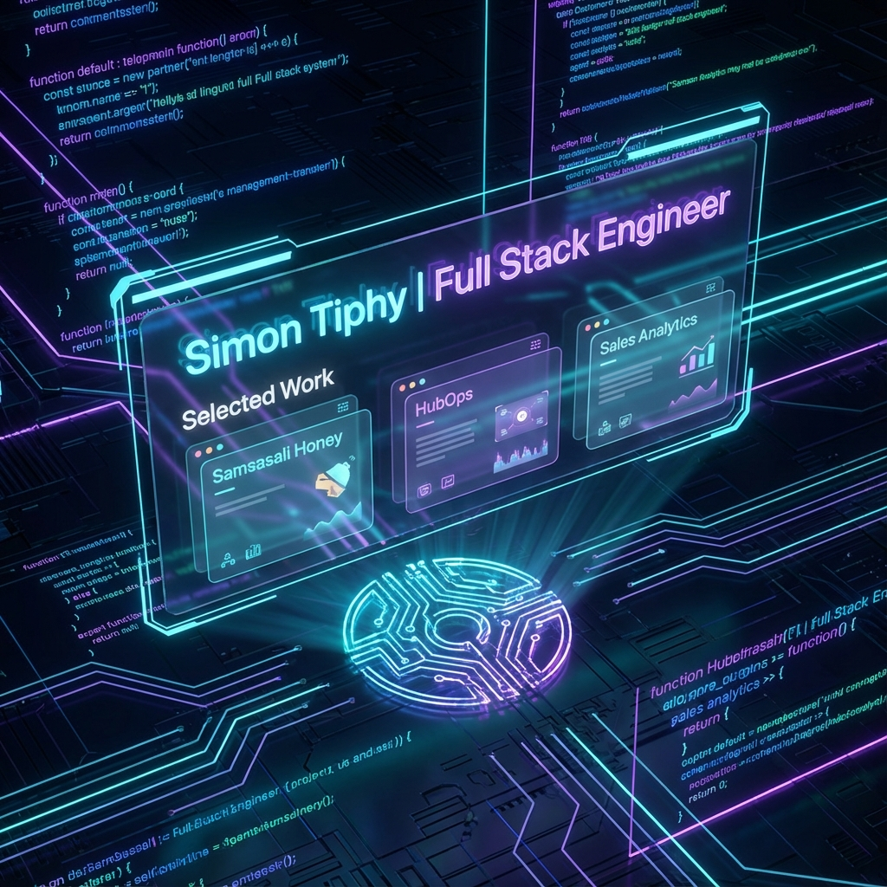

# Simon Tiphy | Full Stack Portfolio

Welcome to my personal portfolio codebase. This project showcases my selected works, technical skills, and experience as a Full Stack Engineer.

## Selected Work



### Key Projects

- **Samsasali Honey**: A premium e-commerce platform.
- **HubOps**: DevOps & Operational management platform.
- **Sales Analytics**: Data visualization dashboard.
- **Bank App**: Secure transaction system.
- **CRM System**: Customer Relationship Management tool.

## Tech Stack

This portfolio is built with modern web technologies focusing on performance and aesthetics:

- **Frontend**: React, Vite
- **Styling**: Tailwind CSS, clsx
- **Animations**: Framer Motion
- **Icons**: Lucide React

## Getting Started

To run this project locally:

1. **Clone the repository**

   ```bash
   git clone https://github.com/simon-tiphy/simontiphyportfolio.git
   cd simontiphyportfolio
   ```

2. **Install Dependencies**

   ```bash
   cd frontend
   npm install
   ```

3. **Run Development Server**
   ```bash
   npm run dev
   ```

## Features

- **Interactive Bento Grid**: A responsive grid layout showcasing projects.
- **Project Modal**: Click on any project card to view details and choose between "Live Site" or "Source Code".
- **Glassmorphism Design**: Modern UI with backdrop blurs and gradients.

---

Designed & Built by **Simon Tiphy**.
